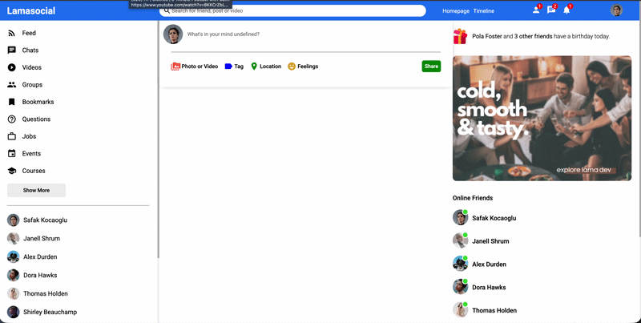

# 🦙 Lamasocial

Facebook benzeri tam özellikli bir sosyal medya platformu. React tabanlı frontend ve Node.js/Express tabanlı backend ile geliştirilmiş full-stack bir web uygulamasıdır.

---

## 📸 Ekran Görüntüleri



---

## 🚀 Özellikler

- 📰 Feed — arkadaşların paylaşımlarını göster
- 💬 Gerçek zamanlı sohbet
- 🎥 Video akışı
- 👥 Gruplar
- 🔖 Yer imleri
- ❓ Sorular & Cevaplar
- 💼 İş ilanları
- 📅 Etkinlikler
- 🎓 Kurslar
- 🟢 Online arkadaş listesi
- 🔔 Bildirimler (arkadaş isteği, mesaj, genel)
- 📸 Fotoğraf/Video paylaşımı, Etiket, Konum, Duygu durumu
- 🔐 Kullanıcı kimlik doğrulama (bcrypt + JWT)
- 🖼️ Profil ve kapak fotoğrafı yükleme (multer)

---

## 🛠️ Kullanılan Teknolojiler

### Frontend
| Teknoloji | Versiyon |
|-----------|----------|
| React | ^17.0.2 |
| React Router DOM | ^5.2.0 |
| Material UI | ^4.12.3 |
| Axios | ^1.17.0 |
| Timeago.js | ^4.0.2 |

### Backend
| Teknoloji | Versiyon |
|-----------|----------|
| Express | ^5.2.1 |
| MongoDB / Mongoose | ^9.6.3 |
| bcrypt | ^6.0.0 |
| Multer | ^2.1.1 |
| Helmet | ^8.2.0 |
| Morgan | ^1.11.0 |
| CORS | ^2.8.6 |
| dotenv | ^17.4.2 |

---

## 📁 Proje Yapısı

```
lamasocial/
├── react-social/          # React frontend
│   ├── public/
│   └── src/
│       ├── components/
│       │   ├── feed/
│       │   ├── sidebar/
│       │   ├── rightbar/
│       │   ├── post/
│       │   └── topbar/
│       ├── pages/
│       │   ├── home/
│       │   ├── profile/
│       │   ├── login/
│       │   └── register/
│       └── App.js
└── api/                   # Node.js backend
    ├── models/
    ├── routes/
    ├── middleware/
    ├── public/
    │   └── images/        # Yüklenen görseller
    └── index.js
```

---

## ⚙️ Kurulum

### Gereksinimler

- Node.js (v18+)
- MongoDB

### 1. Repoyu Klonla

```bash
git clone https://github.com/kullanici-adi/lamasocial.git
cd lamasocial
```

### 2. Backend Kurulumu

```bash
cd api
npm install
```

`.env` dosyası oluştur:

```env
PORT=8800
MONGO_URI=mongodb://localhost:27017/lamasocial
JWT_SECRET=gizli_anahtar_buraya
```

Sunucuyu başlat:

```bash
npm start
```

### 3. Frontend Kurulumu

```bash
cd react-social
npm install
npm start
```

Uygulama `http://localhost:3000` adresinde çalışmaya başlayacaktır.

---

## 🔗 API Endpointleri

| Method | Endpoint | Açıklama |
|--------|----------|----------|
| POST | `/api/auth/register` | Kullanıcı kaydı |
| POST | `/api/auth/login` | Kullanıcı girişi |
| GET | `/api/users/:id` | Kullanıcı bilgisi getir |
| PUT | `/api/users/:id` | Profil güncelle |
| GET | `/api/posts/timeline/:id` | Timeline postları |
| POST | `/api/posts` | Yeni post oluştur |
| PUT | `/api/posts/:id/like` | Beğen / Beğenme |
| DELETE | `/api/posts/:id` | Post sil |

---


## 🤝 Katkıda Bulunma

1. Bu repoyu fork edin
2. Yeni bir branch oluşturun (`git checkout -b feature/yeni-ozellik`)
3. Değişikliklerinizi commit edin (`git commit -m 'Yeni özellik eklendi'`)
4. Branch'i push edin (`git push origin feature/yeni-ozellik`)
5. Pull Request açın

---

## 📄 Lisans

Bu proje MIT lisansı altında lisanslanmıştır.

---

